## The Class Design and Code Flow for ECL Watch Test Suite

### TestRunner.java

The TestRunner class is responsible for setting up and executing automated tests using the TestNG framework in a
Selenium-based testing environment. It handles the initialization of logging and WebDriver, dynamically loads the 
test classes to be executed, and runs the tests.

Variables:
args: Command line arguments passed to the main method. While running the test suite, you can pass arguments in this way -> "-l log_level -p path".
- "log_level" is of two types "debug" and "detail"
- "debug" means generate error and exception log file with a debug log file.
- "detail" means generate error and exception log file with a detailed debug file.
- If no -l and log_level is passed in the argument, only error and exception log will be generated
- "path" is the path of the folder where the json files are
- The code will log an error if the '-p' and 'path' arguments are not provided, as the JSON folder path is required for the test suite.
- -h in the CLI arguments prints the details of parameter usage to the console

path could be something like:

for GitHub Actions -> /home/runner/HPCCSystems-regression/log/

for local machine -> C:/Users/{your_working_directory_of_json_files}/

So an example of complete CLI arguments would look like this:

-l detail -p /home/runner/HPCCSystems-regression/log/

**Methods:**

1. main Method

The entry point of the application. It performs the following steps:

- Calls getCommandLineParameters method to get the log level and the path of JSON files from CLI arguments and configure them in the Config file.
- Calls Common.initializeLoggerAndDriver to configure the logging system and web driver.
- If the drives sets up properly and is not null, it creates an instance of TestNG.
- Sets the test classes to be run by calling loadClasses.
- Runs the tests using TestNG.
- Quits the WebDriver session after the tests have completed.
- Calls Common.printNumOfErrorsAndExceptions to print total number of errors and exceptions to the console, so that we get an idea of the count after the tests are finished.

2. loadClasses Method

Loads the test classes specified in TestClasses.testClassesList:

- Iterates over the testClassesList and loads each class by its fully qualified name.
- Adds the loaded class to the list classes.
- Catches and prints any ClassNotFoundException.

3. getCommandLineParameters Method

This method is designed to parse command-line arguments to set the log level and the path to a folder containing JSON files. It validates the presence of these arguments and sets configuration values accordingly.

- It takes a single parameter, args, which is an array of strings representing the command-line arguments passed to the program.
- Three local variables, log_level, path and help, are initialized to null. These will hold the values extracted from the command-line arguments.
- A for loop iterates through the args array to examine each argument.
- The loop uses i as the index variable to traverse the array.
- Inside the loop, check if the current argument equals "-l".
- If "-l" is found and there is another argument following it (i + 1 < args.length), assign the value of the next argument to log_level and increment the index i to skip the processed argument.
- Similarly, check if the current argument equals "-p".
- If "-p" is found and there is another argument following it (i + 1 < args.length), assign the value of the next argument to path and increment the index i to skip the processed argument.
- If "-h" is found, assign true to help.
- After the loop, check if log_level is not null. If it is not null, assign its value to Config.LOG_LEVEL.
- Check if path is not null. If it is not null, assign its value to Config.PATH_FOLDER_JSON.
- If path is still null after the loop, log an error message indicating that the JSON folder path is required. Use Common.logError to log this error.
- Check if help is true. If help is true call printParameterUsage method to print the details of parameter usage to the console.

4. printParameterUsage Method

This method just print the details of parameter usage to the console for better user interaction.

### TestClasses.java

The TestClasses class in the framework.config package is responsible for maintaining
a list of test classes used in the framework. This class provides a centralized and
immutable collection of test class metadata, which includes the name of each test
class and its fully qualified class name. This setup helps organize and reference
the test classes easily throughout the testing framework. By using the TestClasses
class, the framework can dynamically load and execute tests, enhancing modularity
and maintainability.

### TestClass.java

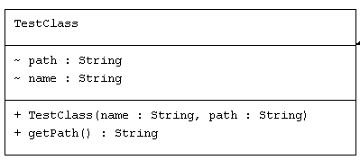

The TestClass class in the framework.model package is a simple model class designed
to encapsulate metadata about a test class within the testing framework. It contains
the name of the test class and its fully qualified class name (path). This class
provides a structured way to store and retrieve information about each test class,
which can be utilized by other components in the framework for dynamically loading and
executing tests.

### URLMapping.java

The URLMapping class in the framework.model package is a model that represents a URL 
and its associated metadata. It provides a structured way to store URLs and their hierarchical
relationships, facilitating easy navigation and retrieval of URLs in a web application.

#### Variables:
- name: A String representing the name of the navigation element or tab.
- url: A String representing the URL associated with the navigation element or tab.
- urlMappings: A HashMap<String, URLMapping> that maps the names of nested navigation elements or tabs to their corresponding URLMapping objects.

### Config.java

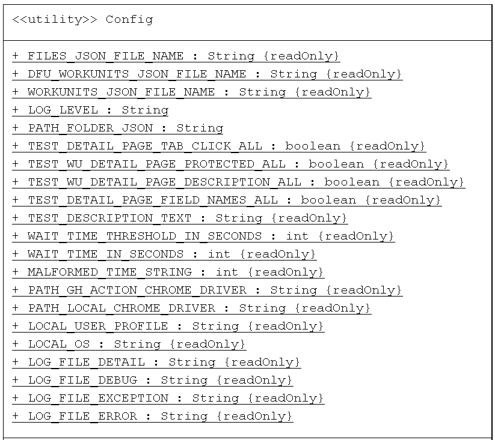

The Config class in the framework.config package serves as a centralized configuration
repository for the application. It contains various constants that are used throughout
the framework, providing a single point of reference for configuration settings such as
file paths, file names, flags, and other constants. This approach enhances the maintainability and
readability of the code by avoiding hard-coded values scattered across different classes.

### URLConfig.java

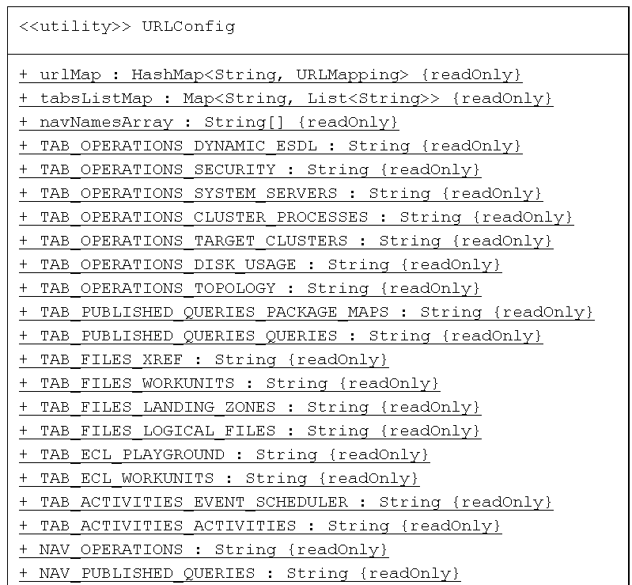

The URLConfig class is designed to manage the URL configurations for different navigation
and tab pages within the test cases. It provides a structured way to store and retrieve 
URLs associated with various sections of the ECL Watch UI. This class uses constants to define 
URLs and page names, and it leverages a HashMap to store URL mappings, facilitating easy access 
to the URLs of different pages and tabs.

- NAV_ACTIVITIES, NAV_ECL, NAV_FILES, NAV_PUBLISHED_QUERIES, NAV_OPERATIONS: Constants representing main navigation sections.
- TAB_ACTIVITIES_ACTIVITIES, TAB_ACTIVITIES_EVENT_SCHEDULER: Tab names under the Activities navigation.
- TAB_ECL_WORKUNITS, TAB_ECL_PLAYGROUND: Tab names under the ECL navigation.
- TAB_FILES_LOGICAL_FILES, TAB_FILES_LANDING_ZONES, TAB_FILES_WORKUNITS, TAB_FILES_XREF: Tab names under the Files navigation.
- TAB_PUBLISHED_QUERIES_QUERIES, TAB_PUBLISHED_QUERIES_PACKAGE_MAPS: Tab names under the Published Queries navigation.
- TAB_OPERATIONS_TOPOLOGY, TAB_OPERATIONS_DISK_USAGE, TAB_OPERATIONS_TARGET_CLUSTERS, TAB_OPERATIONS_CLUSTER_PROCESSES, TAB_OPERATIONS_SYSTEM_SERVERS, TAB_OPERATIONS_SECURITY, TAB_OPERATIONS_DYNAMIC_ESDL: Tab names under the Operations navigation.
- navNamesArray: Array containing all the main navigation names.
- tabsListMap: Map containing lists of tab names associated with each main navigation section.
- urlMap: A HashMap (urlMap) is created to store URL mappings. This map will use the page name as the key and a URLMapping object as the value. The URLMapping object contains the page name, its URL, and another HashMap for nested pages and tabs.
- A static block is used to initialize the urlMap with the initial URL mapping for the Activities navigation. The URL is retrieved using a method from the Common utility class, which handles the dynamic retrieval of the IP address based on the environment whether it is local or GitHub Actions.

#### Implementation Steps for URL Management

- For each main navigation section, a URLMapping object is created. This object includes the page name and its corresponding URL. Additionally, it contains another HashMap to store URLs for nested tabs and pages.
- Each URLMapping object is stored in the urlMap with the main navigation name as the key. This initial setup ensures that each navigation section has its base URL stored and accessible.
- For instance, for any navigation page, each page has multiple tabs, and within those tabs, there are multiple pages and tabs. This structure facilitates easy access to the URL of a particular page. 
- Starting from the Activities page, for each main navigation section, the code iterates over its associated tabs (as defined in tabsListMap). For each tab, a new URLMapping object is created and added to the HashMap within the corresponding URLMapping object of the main navigation section. This creates a tree-like structure, allowing easy access to URLs for both navigation sections and their nested tabs.
- By following these implementation steps, the URLConfig class ensures that all URLs within the application are well-organized and easily accessible through a hierarchical structure. This setup simplifies navigation and URL management within the application, making it easier to handle complex page structures and dynamic URL retrievals.

### Common.java

The Common class in the framework.utility package provides a set of utility
methods that are frequently used throughout the testing framework. These
methods handle common tasks and leverages constants from the Config class to maintain consistency 
and facilitate configuration management.

Variables:

- driver: This public static variable stores the WebDriver instance used for interacting with the web browser.
- errorLogger: This public static variable stores a logger instance used for logging error messages.
- specificLogger: This public static variable stores a logger instance used for logging specific messages 
based on the provided level (debug or detail).
- num_errors: A counter to keep a count of total numbers of errors generated in the error log file.
- num_exceptions: A counter to keep a count of total numbers of exceptions generated in the exceptions log file.

**Methods:**

1. checkTextPresent Method

Checks if the specified text is present on the current webpage and logs the result.

- Retrieves the page source using driver.getPageSource().
- Checks if the page source contains the specified text.
- Logs a success message if the text is found; otherwise, logs an error message and records it using the provided
  logger.

2. openWebPage Method

Opens the specified URL in the browser and maximizes the window.

- Navigates to the specified URL using driver.get(url).
- Maximizes the browser window using driver.manage().window().maximize().
- Calls the sleep method to pause the execution for a short period to allow the page to load completely.

3. sleep Method

The sleep method pauses the execution of the program for a specified duration
(4 seconds in this case). This can be useful in scenarios where a delay is required,
such as waiting for a webpage to load completely before proceeding with further actions.

4. isRunningOnLocal Method

Determines if the code is running on a local environment.

- Checks if the operating system name starts with the value of Config.LOCAL_OS.
- Checks if the user profile path starts with the value of Config.LOCAL_USER_PROFILE.
- Returns true if both conditions are met, indicating a local environment; otherwise, returns false.

5. getIP Method

The getIP method determines the appropriate IP address to use based on whether the application 
is running in a local environment or in a GitHub Actions environment. 
This helps in dynamically adjusting the base URL of the application depending on the 
execution context.

- Calls isRunningOnLocal to check the environment.
- If running locally, returns the URLConfig.LOCAL_IP.
- If running in GitHub Actions, returns the URLConfig.GITHUB_ACTION_IP.

6. waitForElement Method

- This method waits for a web element to be present in the DOM.
- Uses WebDriverWait to wait up to 10 seconds for the presence of the specified web element.

7. logError Method

- This method logs error messages.
- Prints the error message to the standard error stream.
- Logs the message using errorLogger.
- Increments the variable num_errors by 1, to maintain the count of number of errors generated.

8. logException Method

- This method logs exception messages with complete stack trace.
- Prints the exception message with complete stack trace to the standard error stream.
- Logs the message using errorLogger.
- Increments the variable num_exceptions by 1, to maintain the count of number of num_exceptions generated.

9. logDebug Method

- This method logs debug or detailed messages.
- Prints the message to the standard output stream.
- Logs the message using specificLogger if the logging level is INFO or FINE.

10. logDetail method

- This method logs detailed messages.
- Prints the message to the standard output stream.
- Logs the message using specificLogger if the logging level is FINE.

11. initializeLoggerAndDriver Method

- This method initializes the logger and WebDriver instances.
- Sets up the specificLogger based on the provided argument.
- Sets up the WebDriver instance using setupWebDriver() method.

12. setupWebDriver Method

- This method sets up the WebDriver instance based on the environment.
- Configures ChromeOptions for headless mode, no sandbox, and suppressed log output.
- Sets up the WebDriver based on the environment (local or GitHub Actions).
- Logs an error message if an exception occurs during setup.

13. setupLogger Method

- This method sets up a logger instance based on the provided log level (error, exception, debug and detail).
- It creates a CustomFormatter instance. This formatter will be used to format log messages according to a specified pattern.
- Configures the logger to disable console logging and set up file handlers for different log levels (error, exception, debug, detail).
- For "error" and "exception" levels, it sets up a FileHandler with a corresponding file path from Config.LOG_FILE_ERROR or Config.LOG_FILE_EXCEPTION, respectively. The log level is set to Level.SEVERE.
- For "debug", it sets up a FileHandler with Config.LOG_FILE_DEBUG and sets the log level to Level.INFO.
- For "detail", it sets up a FileHandler with Config.LOG_FILE_DETAIL and sets the log level to Level.FINE.
- Turns off all logging from Selenium WebDriver. 
- Logs an error message if an exception occurs during logger setup.
- Finally, the method returns the configured Logger instance.

14. sleepWithTime Method

- The sleepWithTime method pauses the execution of the current thread for a specified number of seconds. 
- It is a simple utility method used to introduce a delay in the execution flow.
- Used to wait for a certain condition or state before proceeding with further execution.

15. waitForElementToBeClickable Method

- This method waits until the specified web element is clickable. 
- A WebDriverWait instance is created with a timeout duration specified by Config.WAIT_TIME_THRESHOLD_IN_SECONDS.
- The method waits until the element is clickable, using Selenium's ExpectedConditions.elementToBeClickable condition.
- It is useful in scenarios where an element needs to be interacted with, but it might not be immediately clickable due to loading times or other conditions.

16. waitForElementToBeDisabled Method

The waitForElementToBeDisabled method waits until the specified web element is disabled by checking its aria-disabled attribute.
The attribute "aria-disabled" is part of the Accessible Rich Internet Applications (ARIA) specification, which is used to improve the accessibility of web pages.
aria-disabled is a standard attribute and is widely used in HTML to indicate whether an element is disabled. It is system-defined, meaning it is part of the standard 
HTML specifications and not a custom class or attribute that might change frequently. By using aria-disabled, you ensure that the check for the disabled state is 
consistent and less likely to break due to UI changes. Custom class names or attributes defined by developers can change frequently during updates or redesigns, 
but standard attributes like aria-disabled are much more stable.

- A WebDriverWait instance is created with a timeout duration specified by Config.WAIT_TIME_THRESHOLD_IN_SECONDS.
- The method waits until the aria-disabled attribute of the element contains the value "true", indicating that the element is disabled.
- Ensures that an element has transitioned to a disabled state before proceeding with further actions.

### CustomFormatter.java

The CustomFormatter class in the framework.utility package extends Formatter and uses a SimpleDateFormat instance to define the format of the timestamps in the log messages. The format specified is "yyyy-MM-dd HH:mm:ss", which outputs timestamps in a year-month-day hour:minute:seconds
format.

1. format Method

- The format method overrides the abstract method from the Formatter class to define how log records should be formatted.
- It takes a LogRecord object as a parameter, which contains information about the log message, including the timestamp and the message itself.
- The method converts the timestamp from milliseconds since the epoch (obtained from record.getMillis()) into a Date object.
- It then formats this Date object using the SimpleDateFormat instance to get a readable date-time string.
- Finally, it returns a formatted string consisting of the formatted date-time followed by the log message and a newline character. This ensures that each log entry starts with a timestamp and is followed by the log message.

### TimeUtils.java

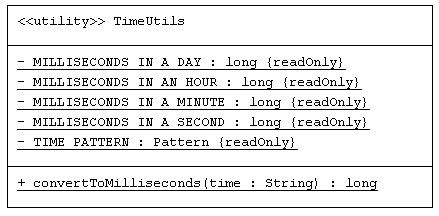

The TimeUtils class in the framework.utility package provides utility functions to handle
time strings and convert them into milliseconds. This is useful for standardizing time
representations and performing time-based calculations in a consistent manner.

TIME_PATTERN: A regular expression pattern used to match various time formats. The supported formats are:

- d days h:m:s.s
- h:m:s.s
- m:s.s
- s.s

**Methods:**

1. convertToMilliseconds Method

This method converts a time string into milliseconds based on the matched pattern. If the
time string does not match any recognized format, it returns a predefined constant for
malformed time strings.

- The method first attempts to match the input time string against the TIME_PATTERN.
- If the string matches the pattern, it initializes the time components (days, hours, minutes, seconds, milliseconds) to
  zero.
- The method then extracts values based on the matching groups.
- If any parsing errors occur (e.g., NumberFormatException) or if the string does not match the pattern, the method
  returns Config.MALFORMED_TIME_STRING.
- If the parsing is successful, the method calculates the total duration in milliseconds

### NavigationWebElement

This NavigationWebElement class in the framework.model package, is a record class used to represent a navigation element
within a web application framework. It offers a concise way to store and manage information about such
elements.

- The class is defined as a record which is a recent addition to Java that simplifies creating immutable data classes.
- It has three properties:
    - name: A String representing the name or identifier of the navigation element in the menu bar(e.g., "Activities", "
      ECL", "Files).
    - hrefValue: A String representing the href attribute value of the element, which typically specifies the URL linked
      to by the element.
    - webElement: A WebElement object from the Selenium library. This holds the actual WebElement instance representing
      the element in the web page.

- Due to the record nature, a constructor is not explicitly defined. The compiler generates a constructor that takes
  arguments for each property and initializes them.
- The NavigationWebElement class offers a structured way to manage data related to navigation elements in a web
  application framework.

### Java Classes for Representing Workunit JSON Data

This section details the class structure used to map JSON data file of list of "Workunit"
entities into Java objects. These classes provide a clear representation of the data and
allow for easy access to its values throughout the codebase. This structure is particularly
beneficial for writing test cases, as it simplifies working with the data in a well-defined
format. Below are the UML diagram of the classes used for JSON mapping to java objects for
workunits JSON file.

So the first java object created to map the json is WUQueryRoot (equivalent to the root object of JSON) 
which contains the WUQueryResponse object (equivalent to the WUQueryResponse key in json file) inside it 
and WUQueryResponse contains the WUWorkunits object (equivalent to the Workunits key in json file) 
inside it, and then finally a list of WUECLWorkunit object (equivalent to the ECLWorkunit key in json file) is inside the WUWorkunits object.
Inside each WUECLWorkunit object, there is WUApplicationValues object (equivalent to the ApplicationValues key in json), which further have a list of
WUApplicationValue objects (equivalent to the ApplicationValue key in json file) inside it.
This is how the structure of Java objects created with respect to the JSON structure of workunits.

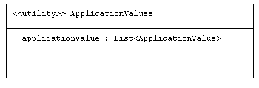

### ActivitiesTest

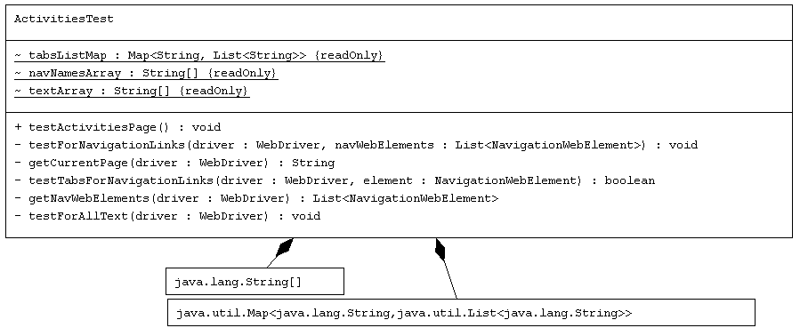

This ActivitiesTest class in the framework.pages package, implements a TestNG test (@Test)
for the Activities page of ECL Watch UI. It focuses on verifying the following aspects of the
Activities page:

- Presence of specific text elements
- Functionality of navigation links and their corresponding sub-tabs

**Class Variables:**

- textArray: A static final String array containing expected text elements to be present on the Activities page (e.g., "
  Target/Wuid", "Graph").

**Methods:**

1. testActivitiesPage (Test Method)

- This is the main test method annotated with @Test to be run as a test case.
- Initializes the WebDriver instance. 
- Use the Common.openWebPage method to navigate to the URL of the Activities page, retrieved from the urlMap.
- Logs the start of the tests for the "Activities" page. 
- Calls testForAllText(driver) to check for the presence of predefined texts. 
- Retrieves the navigation web elements by calling getNavWebElements(driver). 
- Calls testForNavigationLinks(driver, navWebElements) to test the navigation links. 
- Logs the completion of the tests for the "Activities" page.

2. testForAllText Method

- This method checks if specific texts are present on the "Activities" page.
- Logs the start of text presence tests. 
- Iterates over each text in textArray. 
- Calls Common.checkTextPresent(driver, text, "Activities Page") to verify the presence of each text on the page.

3. testForNavigationLinks Method

- This method tests each navigation link to ensure they direct to the correct pages with the expected tabs. 
- Logs the start of navigation link tests. 
- Iterates over each NavigationWebElement in navWebElements. 
- Clicks on each navigation element and verifies the presence of corresponding tabs by calling testTabsForNavigationLinks(driver, element). 
- Logs success if all tabs are present; otherwise, logs an error with the current page details. 
- Catches and logs any exceptions that occur during the process.

4. getCurrentPage Method

- This method determines the current page by checking the presence of specific tabs.
- Iterates over each entry in tabsListMap. 
- Checks if all tabs for each page are present in the page source. 
- Returns the page name if all tabs are present; otherwise, returns "Invalid Page".

5. testTabsForNavigationLinks Method:

- This method verifies the presence of tabs for a given navigation element and updates the URL map with the tab URLs.
- Get the list of tabs associated with the navigation element from URLConfig.tabsListMap.
- Loop through each tab in the list.
- Use Common.waitForElement to wait for the tab element to be present in the DOM.
- Add the tab's URL to the urlMap under the corresponding navigation element.
- If a timeout exception occurs, return false. Otherwise, return true.

6. getNavWebElements Method:

- This method retrieves the web elements for the main navigation links on the Activities page.
- Creates an empty list to store NavigationWebElement objects.
- Iterates through the URLConfig.navNamesArray.
- For each navigation link name:
    - Finds the WebElement using driver.findElement with By.name strategy.
    - Extracts the href attribute value.
    - Creates a new NavigationWebElement object with the name, href value, and WebElement reference.
    - Adds the NavigationWebElement to the list.
    - Add the navigation element's URL to the urlMap.
    - Log any errors that occur during the process.
- Returns the list of NavigationWebElement objects.

### BaseTableTest

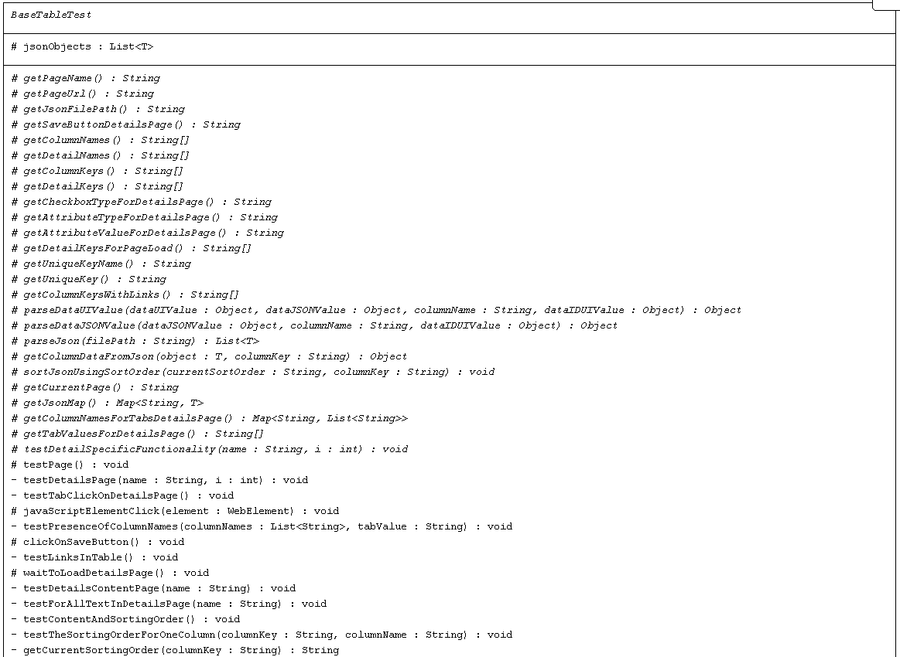

The BaseTableTest\<T>\ class is designed as a superclass for testing web pages containing tabular data. It is intended for use in automated tests,
particularly for pages like workunits, files, and queries, and includes functionality for testing their respective details pages.  
It defines methods for common functionalities like:

- Verifying the presence of expected text elements on the page.
- Comparing the content displayed in the table with corresponding data from a JSON file.
- Testing the sorting functionality of the table columns.
- Verifying links within the table cells and their navigation behavior.
- Testing common details functionality, such as tab clicks.

**Abstract Methods:**

These methods must be implemented by subclasses to provide specific information and functionality for the page being tested:

1.	getPageName(): Returns the name of the page.
2.	getPageUrl(): Returns the URL of the page.
3.	getJsonFilePath(): Returns the file path for the JSON data file.
4.	getSaveButtonDetailsPage(): Returns the text for the save button on the details page.
5.	getColumnNames(): Returns an array of column names displayed in the table.
6.	getDetailNames(): Returns an array of detail names for the details page.
7.	getColumnKeys(): Returns an array of column keys for accessing data.
8.	getDetailKeys(): Returns an array of detail keys for accessing data on the details page.
9.	getCheckboxTypeForDetailsPage(): Returns the attribute type for checkboxes on the details page.
10.	getAttributeTypeForDetailsPage(): Returns the attribute type for elements on the details page.
11.	getAttributeValueForDetailsPage(): Returns the attribute value for elements on the details page.
12.	getDetailKeysForPageLoad(): Returns an array of detail keys to check when the details page loads.
13.	getUniqueKeyName(): Returns the unique key name for identifying data.
14.	getUniqueKey(): Returns the unique key used for identifying data in the table.
15.	getColumnKeysWithLinks(): Returns an array of column keys that contain links.
16.	parseDataUIValue(dataUIValue, dataJSONValue, columnName, dataIDUIValue): Parses the UI data value.
17.	parseDataJSONValue(dataJSONValue, columnName, dataIDUIValue): Parses the JSON data value.
18.	parseJson(filePath): Parses the JSON file and returns a list of objects.
19.	getColumnDataFromJson(object, columnKey): Gets column data from a JSON object.
20.	sortJsonUsingSortOrder(currentSortOrder, columnKey): Sorts the JSON data using the specified order and column key.
21.	getCurrentPage(): Returns the current page.
22.	getJsonMap(): Returns a map of JSON data.
23.	getColumnNamesForTabsDetailsPage(): Returns a map of column names for tabs on the details page.
24.	getTabValuesForDetailsPage(): Returns an array of tab values for the details page.
25.	testDetailSpecificFunctionality(name, i): Tests specific functionality on the details page.

**Non-Abstract Methods:**

####  Method: `testPage()`

This method initiates and executes a series of tests on a web page.

1. **Open the Web Page**: The method begins by opening the specified web page using `Common.openWebPage(getPageUrl())`.

2. **Logging**: It logs the start of tests for the page with `Common.logDebug`.

3. **Test for All Text**: The method `testForAllText()` is called to verify the presence of expected text elements on the page.

4. **Retrieve JSON Objects**: It retrieves all JSON objects using `getAllObjectsFromJson()` and stores them in `jsonObjects`.

5. **Dropdown Selection**: If `jsonObjects` is not null, it determines the number of items in JSON (`numOfItemsJSON`) and uses `clickDropdown(numOfItemsJSON)` to select the appropriate dropdown value for displaying items on the page.

6. **Content and Sorting Tests**: The method `testContentAndSortingOrder()` is called to verify the content and sorting order of items on the page.

7. **Link Tests**: It calls `testLinksInTable()` to test all the links in the table present on the page.

8. **Logging**: Logs the completion of tests with `Common.logDebug`.

9. **Exception Handling**: Catches any exceptions that occur during the test and logs the error with `Common.logError`.

####  Method: `testDetailsPage(String name, int i)`

This method tests various aspects of a details page for a specific item.

1. **Test Detail Page Field Names**: Depending on the configuration `Config.TEST_DETAIL_PAGE_FIELD_NAMES_ALL`, it calls `testForAllTextInDetailsPage(name)` either for all items or just the first item.

2. **Details Content Page Test**: It calls `testDetailsContentPage(name)` to verify the content of the details page.

3. **Detail Specific Functionality Test**: The method `testDetailSpecificFunctionality(name, i)` is called to test specific functionality on the details page.

4. **Test Tab Clicks**: Depending on the configuration `Config.TEST_DETAIL_PAGE_TAB_CLICK_ALL`, it calls `testTabClickOnDetailsPage()` either for all items or just the first item.

####  Method: `testTabClickOnDetailsPage()`

This method tests the functionality of clicking through different tabs on the details page.

1. **Logging**: Logs the start of the tab click test with `Common.logDebug`.

2. **Wait for Page Load**: Calls `waitToLoadDetailsPage()` to ensure the details page is fully loaded.

3. **Iterate Through Tabs**: For each tab value retrieved from `getTabValuesForDetailsPage()`:
    - It tries to find the tab button element and clicks it using `javaScriptElementClick`.
    - It then calls `testPresenceOfColumnNames(getColumnNamesForTabsDetailsPage().get(tabValue), tabValue)` to verify the presence of expected column names for the selected tab.
    - If an error occurs, it logs the error with `Common.logError`.

####  Method: `javaScriptElementClick(WebElement element)`

This method clicks a web element using JavaScript.

1. **Execute Script**: Uses a `JavascriptExecutor` to click the specified web element by executing the script `arguments[0].click();`.

####  Method: `testPresenceOfColumnNames(List<String> columnNames, String tabValue)`

This method verifies the presence of specific column names within a tab on the details page.

1. **Check Column Names**: For each column name in the provided list:
    - It waits for the element containing the column name using `Common.waitForElement(By.xpath("//*[text()='" + columnName + "']"))`.
    - If a `TimeoutException` occurs, it logs an error and sets a flag `allPresent` to false.

2. **Logging**: If all column names are present, it logs success with `Common.logDetail`. If any column name is missing, it logs an error.

####  Method: `clickOnSaveButton()`

This method handles the action of clicking the save button on a details page.

1. **Wait for Save Button**: It retrieves the save button element using `getSaveButtonWebElementDetailsPage()` and waits for it to be clickable with `Common.waitForElementToBeClickable`.

2. **Click Save Button**: Clicks the save button.

3. **Wait for Save Completion**: Waits for the save button to become disabled using `Common.waitForElementToBeDisabled`.

####  Method: `testLinksInTable()`

This method tests the functionality and navigation of links present in a table on the page.

1. **Logging**: Logs the start of the link tests with `Common.logDebug`.

2. **Page refresh**: refreshing page as page has scrolled to right for testing the sorting functionality of column headers, so bringing it back to normal view by refreshing it

3. **Iterate Through Columns with Links**: For each column key with links retrieved from `getColumnKeysWithLinks()`:
    - It retrieves the data values from the UI using `getDataFromUIUsingColumnKey(columnKey)`.
    - For each value, it tries to find and click the corresponding link element.
    - After clicking, it checks if the page source contains the name to confirm successful navigation.
    - Logs success or failure based on the result.
    - It then navigates back to the original page and refreshes it.
    - It verifies if the dropdown value remains unchanged after navigation.

3. **Exception Handling**: Catches any exceptions during the link tests and logs the errors.

####  Method: `waitToLoadDetailsPage()`

This method ensures the details page is fully loaded by waiting for specific elements to be visible.

1. **Initialize Wait Time**: Starts with an initial wait time specified by `Config.WAIT_TIME_IN_SECONDS`.

2. **Check Element Visibility**: Repeatedly checks the visibility of detail keys retrieved from `getDetailKeysForPageLoad()`:
    - Waits for each element by its ID using `Common.waitForElement`.
    - If any element's attribute is empty, it continues waiting and increments the wait time.

3. **Logging**: Logs the total wait time used to load the details page with `Common.logDebug`.

####  Method: `testDetailsContentPage(String name)`

This method tests the content of a details page for a specific item.

1. **Logging**: Logs the start of the content tests with `Common.logDebug`.

2. **Wait for Page Load**: Calls `waitToLoadDetailsPage()` to ensure the page is fully loaded.

3. **Compare Content**: For each detail key:
    - It retrieves the corresponding web element and its value.
    - Compares the value with the expected JSON value.
    - Logs errors if there are discrepancies.

4. **Logging**: Logs success if all values match the expected values.

####  Method: `testForAllTextInDetailsPage(String name)`

This method tests the presence of specific text elements on a details page.

1. **Logging**: Logs the start of the text tests with `Common.logDebug`.

2. **Check Text Presence**: For each expected text element retrieved from `getDetailNames()`:
    - Calls `Common.checkTextPresent` to verify the text presence on the page.

####  Method: `testContentAndSortingOrder()`

This method tests the content and sorting order of items on a page.

1. **Logging**: Logs the start of content tests with `Common.logDebug`.

2. **Test Table Content**: Calls `testTableContent()` to verify the content of the table.

3. **Test Sorting Order**: If the content test passes, it logs the start of sorting order tests and:
    - Iterates through each column key and name.
    - Calls `testTheSortingOrderForOneColumn(columnKey, columnName)` to verify the sorting order.

####  Method: `testTheSortingOrderForOneColumn(String columnKey, String columnName)`

This method tests the sorting order of a specific column.

1. **Retrieve Sorting Order**: Calls `getCurrentSortingOrder(columnKey)` to retrieve the current sorting order for the column.

2. **Compare Data**: If a sorting order is retrieved, it:
    - Retrieves data from the UI and JSON.
    - Sorts JSON data using the retrieved sorting order.
    - Compares the UI and JSON data.
    - Logs success if the data is correctly sorted; otherwise, logs an error.

####  Method: `getCurrentSortingOrder(String columnKey)`

This method retrieves the current sorting order of a column.

1. **Find Column Header**: Locates the column header element for the specified column key.

2. **Scrolls To Find Header**: Uses JavascriptExecutor to scroll and bring the column header into view.

3. **Retrieve Sort Order**: Retrieves the current sorting order from the column header's attribute `aria-sort`.

4. **Click to Change Sort Order**: Clicks the column header to change the sort order and waits for the sorting order to change using `waitToLoadChangedSortOrder`.

5. **Return New Sort Order**: Returns the new sorting order.

####  Method: `waitToLoadChangedSortOrder(String oldSortOrder, String columnKey)`

This method waits for the sorting order to change after clicking a column header.

1. **Initialize Wait Time**: Starts with an initial wait time specified by `Config.WAIT_TIME_IN_SECONDS`.

2. **Check Sort Order Change**: Repeatedly checks the sorting order of the column header until it changes from the old sort order.

3. **Return New Sort Order**: Returns the new sorting order once it has changed.

####  Method: `getDataFromJSONUsingColumnKey(String columnKey)`

This method retrieves data from JSON objects for a specified column key.

1. **Iterate Through JSON Objects**: For each JSON object:
    - Retrieves the column data using `getColumnDataFromJson`.

2. **Return Data**: Returns the list of column data.

####  Method: `getDataFromUIUsingColumnKey(String columnKey)`

This method retrieves data from the UI based on a specified column key.

1. **Initialize List**: Starts by creating an empty list to store the data.
2. **Load UI Elements**: Calls the `waitToLoadListOfAllUIObjects` method to get all web elements corresponding to the column key.
3. **Extract Text**: Iterates through the list of web elements (excluding the header) and adds the text content of each element to the list.
4. **Error Handling**: If any exception occurs, it logs an error message.
5. **Return Data**: Finally, returns the list of extracted data.

####  Method: `waitToLoadListOfAllUIObjects(String columnKey)`

This method waits until all UI elements corresponding to a column key are loaded.

1. **Initialize Wait Time**: Starts with an initial wait time.
2. **Find Elements**: Uses a loop to repeatedly find web elements in a grid cell matching the column key's XPath.
3. **Check Element Count**: Checks if the number of elements (excluding the header) matches the number of JSON objects.
4. **Wait and Retry**: If the elements are not fully loaded, it sleeps for the current wait time, increments the wait time, and retries.
5. **Return Elements**: Once the elements are fully loaded, returns the list of web elements.

####  Method: `ascendingSortJson(String columnKey)`

This method sorts the JSON objects in ascending order based on a column key.

1. **Sort JSON Objects**: Uses a comparator to sort the list of JSON objects by comparing the values of the specified column key.
2. **Error Handling**: If any exception occurs during sorting, logs an error message.

####  Method: `descendingSortJson(String columnKey)`

This method sorts the JSON objects in descending order based on a column key.

1. **Sort JSON Objects**: Similar to `ascendingSortJson`, but uses a reversed comparator to sort the list in descending order.
2. **Error Handling**: If any exception occurs during sorting, logs an error message.

####  Method: `testTableContent()`

This method tests the content of a table by comparing the UI data with JSON data.

1. **Log Number of Objects**: Logs the number of objects retrieved from JSON.
2. **Retrieve UI Data**: Calls `getDataFromUIUsingColumnKey` to get the data from the UI for the unique key.
3. **Compare Counts**: Compares the number of objects from JSON and UI. Logs an error if they are not equal and returns false.
4. **Initialize Pass Flag**: Initializes a flag to track if all comparisons pass.
5. **Iterate Through Columns**: For each column key:
    - Retrieves data from UI and JSON.
    - Calls `compareData` to compare the data and updates the pass flag based on the result.
6. **Return Result**: Returns the pass flag indicating whether all comparisons passed.

####  Method: `getAllObjectsFromJson()`

This method retrieves all objects from a JSON file.

1. **Get File Path**: Retrieves the path of the JSON file.
2. **Parse JSON**: Calls `parseJson` to parse the JSON file and return a list of objects.
3. **Error Handling**: If any exception occurs during parsing, logs an error message.
4. **Return Data**: Returns the list of parsed objects.

####  Method: `compareData(List<Object> dataUI, List<Object> dataJSON, List<Object> dataIDUI, String columnName)`

This method compares the data from UI and JSON for a specific column.

1. **Initialize Pass Flag**: Initializes a flag to track if all comparisons pass.
2. **Iterate Through Data**: For each item in the data lists:
    - Parses the UI and JSON values.
    - Calls `checkValues` to compare the values and updates the pass flag based on the result.
3. **Log Success**: If all comparisons pass, logs a success message.
4. **Return Result**: Returns the pass flag indicating whether all comparisons passed.

####  Method: `checkValues(Object dataUIValue, Object dataJSONValue, Object dataIDUIValue, String columnName)`

This method checks if the UI value matches the JSON value for a specific column.

1. **Compare Values**: Compares the UI value with the JSON value.
2. **Log Error**: If the values do not match, logs an error message.
3. **Return Result**: Returns a boolean indicating whether the values match.

####  Method: `clickDropdown(int numOfItemsJSON)`

This method selects a dropdown value based on the number of JSON items.

1. **Find Dropdown**: Locates and clicks the dropdown element.
2. **Wait for Dropdown List**: Waits for the dropdown list to become visible.
3. **Determine Selected Value**: Determines the smallest dropdown value greater than the number of JSON items.
4. **Select Option**: Iterates through the options and clicks the one matching the selected value.
5. **Wait for Invisibility**: Waits for the dropdown list to become invisible.
6. **Log and Refresh**: Logs the selected value and refreshes the page.
7. **Error Handling**: If any exception occurs, logs an error message.

####  Method: `getSelectedDropdownValue()`

This method retrieves the currently selected value of a dropdown.

1. **Find Dropdown**: Locates the dropdown element.
2. **Retrieve Text**: Gets and trims the text of the dropdown element.
3. **Error Handling**: If any exception occurs, logs an error message.
4. **Return Value**: Returns the retrieved text.

####  Method: `getSaveButtonWebElementDetailsPage()`

This method retrieves the web element for the save button on the details page.

1. **Locate Save Button**: Uses an XPath to find the save button element.
2. **Return Element**: Returns the located web element.

####  Method: `testForAllText()`

This method tests the presence of specific text elements on a page.

1. **Log Start**: Logs the start of the text tests.
2. **Check Text**: For each expected text element:
    - Calls `Common.checkTextPresent` to verify the text presence on the page.

### ECLWorkUnitsTest

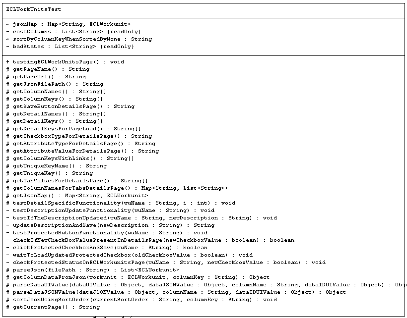

This class, `ECLWorkUnitsTest`, in the framework.pages package, extends the `BaseTableTest`
class and specifically implements test cases for the ECL Workunits page within the ECL Watch UI.
It inherits functionalities for common table testing procedures and specializes them for the
ECL Workunits data and behavior. It includes test cases for both the main page and the details page of the workunits.

#### Class Variables:
- badStates: A list containing states considered as 'bad', such as "compiled" and "failed".
- sortByColumnKeyWhenSortedByNone: A string representing the column key used for sorting columns when no other sorting order is specified, or the sorting order is "none".
- costColumns: A list containing column names related to cost, used for specific parsing operations.
- jsonMap: A map storing ECLWorkunit objects keyed by their unique identifiers (WUID).

#### Methods:

####  Method: `testingECLWorkUnitsPage`
This method is a test method annotated with `@Test`, which indicates that it is a test case to be run using a testing framework like JUnit or TestNG. The method calls `testPage()` to execute the test logic for the ECL Work Units page.

1. Annotate the method with `@Test` to indicate that it is a test case.
2. Within the method, call the `testPage()` method to perform the necessary testing actions on the ECL Work Units page.

####  Method: `getPageName`
This method returns the name of the page being tested, which in this case is "ECL Workunits".

1. Override the method to return the string "ECL Workunits".

####  Method: `getPageUrl`
The getPageUrl method is designed to retrieve the URL of a specific page within the application. It overrides a method from a superclass, BaseTableTest, and provides the URL for the "Workunits" tab under the "ECL" navigation section. This URL is fetched from a pre-configured map of URLs.

1. The method accesses the urlMap from the URLConfig class, which stores URL mappings for different navigation sections and their tabs.
2. The method fetches the URLMapping object for the "ECL" navigation section from the urlMap using URLConfig.NAV_ECL as the key.
3. From the URLMapping object of the "ECL" navigation section, the method retrieves the nested URL mapping for the "Workunits" tab using URLConfig.TAB_ECL_WORKUNITS as the key.
4. Finally, the method returns the URL associated with the "Workunits" tab.

####  Method: `getJsonFilePath`
This method returns the file path of the JSON file containing Workunits test data.
Combine the directory path (Config.PATH_FOLDER_JSON) with the filename (Config.WORKUNITS_JSON_FILE_NAME) to form the complete file path.

1. Override the method to return the local path `Config.PATH_LOCAL_WORKUNITS_JSON` if the test is running locally.
2. Return the CI/CD path `Config.PATH_GH_ACTION_WORKUNITS_JSON` otherwise.

####  Method: `getColumnNames`
This method returns an array of column names to be displayed on the ECL Work Units page.

1. Override the method to return an array of column names: "WUID", "Owner", "Job Name", "Cluster", "State", "Total Cluster Time", "Compile Cost", "Execution Cost", "File Access Cost".

####  Method: `getColumnKeys`
This method returns an array of column keys corresponding to the column names used in the JSON data.

1. Override the method to return an array of column keys: "Wuid", "Owner", "Jobname", "Cluster", "State", "TotalClusterTime", "Compile Cost", "Execution Cost", "File Access Cost".

####  Method: `getSaveButtonDetailsPage`
This method returns the label of the save button on the details page.

1. Override the method to return the string "Save".

####  Method: `getDetailNames`
This method returns an array of detail names to be displayed on the work unit details page.

1. Override the method to return an array of detail names: "WUID", "Action", "State", "Owner", "Job Name", "Description", "Potential Savings", "Compile Cost", "Execution Cost", "File Access Cost", "Protected", "Cluster", "Total Cluster Time", "Aborted by", "Aborted time", "Services".

####  Method: `getDetailKeys`
This method returns an array of detail keys corresponding to the detail names used in the JSON data.

1. Override the method to wait for the element with ID "state" to load.
2. Check if the state value is in the list of bad states (`compiled`, `failed`).
3. If the state is in the bad states list, return a subset of detail keys: "wuid", "action", "state", "owner", "jobname", "cluster".
4. Otherwise, return the full array of detail keys: "wuid", "action", "state", "owner", "jobname", "compileCost", "executeCost", "fileAccessCost", "protected", "cluster", "totalClusterTime".

####  Method: `getDetailKeysForPageLoad`
This method returns an array of keys to be used for loading the details page.

1. Override the method to return an array of keys: "wuid", "state", "jobname", "cluster".

####  Method: `getCheckboxTypeForDetailsPage`
This method returns the type of the checkbox used on the details page.

1. Override the method to return the string "checkbox".

####  Method: `getAttributeTypeForDetailsPage`
This method returns the attribute type used to identify elements on the details page.

1. Override the method to return the string "type".

####  Method: `getAttributeValueForDetailsPage`
This method returns the attribute value used to identify elements on the details page.

1. Override the method to return the string "value".

####  Method: `getColumnKeysWithLinks`
This method returns an array of column keys that contain links.

1. Override the method to return an array with a single key: "Wuid".

####  Method: `getUniqueKeyName`
This method returns the name of the unique key used to identify work units.

1. Override the method to return the string "WUID".

####  Method: `getUniqueKey`
This method returns the key used to uniquely identify work units.

1. Override the method to return the string "Wuid".

####  Method: `getTabValuesForDetailsPage`
This method returns an array of tab values for the details page.

1. Define a method to return an array of tab values: "variables", "outputs", "inputs", "metrics", "workflows", "queries", "resources", "helpers", "xml".

####  Method: `getColumnNamesForTabsDetailsPage`
This method returns a map where each key is the value attribute of an HTML element of a tab, and the value is a list of column names for that tab.

1. Override the method to return a map of tab values and their corresponding column names:
    - "variables": ["Type", "Name", "Value"]
    - "outputs": ["Name", "File Name", "Value", "Views"]
    - "inputs": ["Name", "File Cluster", "Usage"]
    - "metrics": ["Refresh", "Hot spots", "Timeline", "Options"] - there is no column in this tab, so checking the presence of these buttons
    - "workflows": ["Name", "Subtype", "Count", "Remaining"]
    - "queries": ["ID", "Priority", "Name", "Target", "WUID", "Dll", "Published By", "Status"]
    - "resources": ["Name", "Refresh", "Open", "Preview"] - Preview is not a column, it is a button, keeping it for additional check for Resources tab
    - "helpers": ["Type", "Description", "File Size"]
    - "xml": ["<?xml"] - there is no column in this tab, so checking if a xml is present in this tab.
    - no tests for ECL and Logs tab for now as these are too complex to test
   

####  Method: `getJsonMap`
This method returns the JSON map containing the work unit data.

1. Override the method to return the `jsonMap` containing work unit data. This map is populated in the `parseJson` method.

#####  Method: `testDetailSpecificFunctionality`

1. **Method Invocation**: This method overrides a parent class method and is protected.
2. **Parameters**: It takes two parameters: `wuName` (a String representing the work unit name) and `i` (an integer).
3. **Condition Check - Protected Button Functionality**:
    - The method first checks the `Config.TEST_WU_DETAIL_PAGE_PROTECTED_ALL` configuration value.
    - If this configuration is false and `i` is 0, or if the configuration is true, it calls `testProtectedButtonFunctionality` with `wuName` as the argument.
4. **Condition Check - Description Update Functionality**:
    - Similarly, it checks the `Config.TEST_WU_DETAIL_PAGE_DESCRIPTION_ALL` configuration value.
    - If this configuration is false and `i` is 0, or if the configuration is true, it calls `testDescriptionUpdateFunctionality` with `wuName` as the argument.

#####  Method: `testDescriptionUpdateFunctionality`

1. **Log Start**: Logs the start of the description checkbox test for the details page.
2. **Try-Catch Block**:
    - Inside the try block:
        - Retrieves a new description text from the configuration.
        - Calls `updateDescriptionAndSave` to update the description and save the new value, storing the old description.
        - Calls `testIfTheDescriptionUpdated` to verify if the description was updated successfully.
        - Logs the reverting of the description update and reverts the description to the old value using `updateDescriptionAndSave`.
    - If an exception occurs, it catches the exception and logs an error message.

#####  Method: `testIfTheDescriptionUpdated`

1. **Page Refresh**: Refreshes the current page.
2. **Wait for Details Page Load**: Ensures the details page is fully loaded.
3. **Retrieve Description**: Retrieves the updated description from the page element.
4. **Comparison and Logging**:
    - Compares the new description with the updated description.
    - Logs success if they match.
    - Logs an error if they don't match.

#####  Method: `updateDescriptionAndSave`

1. **Wait for Details Page Load**: Ensures the details page is fully loaded.
2. **Retrieve Old Description**: Retrieves the current description from the page element.
3. **Update Description**:
    - Clears the existing text in the description element.
    - Enters the new description text.
4. **Save Changes**: Clicks the save button to save the new description.
5. **Retrieve Updated Description**: Retrieves the description again to confirm the update.
6. **Log Details**: Logs the old and updated descriptions.
7. **Return Old Description**: Returns the old description for reverting later if needed.

#####  Method: `testProtectedButtonFunctionality`

1. **Log Start**: Logs the start of the protected checkbox test for the details page.
2. **Try-Catch Block**:
    - Inside the try block:
        - Calls `clickProtectedCheckboxAndSave` to click the protected checkbox and save the new value, storing the new checkbox value.
        - Calls `checkProtectedStatusOnECLWorkunitsPage` to verify the protected status on the ECL Workunits page.
        - Navigates to the specific work unit's details page.
        - Calls `checkIfNewCheckBoxValuePresentInDetailsPage` to verify the new checkbox value on the details page.
        - If the new checkbox value is present, it logs the reverting of the checkbox value and reverts the value by calling `clickProtectedCheckboxAndSave` again.
    - If an exception occurs, it catches the exception and logs an error message.

#####  Method: `checkIfNewCheckBoxValuePresentInDetailsPage`

1. **Wait for Details Page Load**: Ensures the details page is fully loaded.
2. **Retrieve Checkbox Value**: Retrieves the current value of the protected checkbox.
3. **Comparison and Logging**:
    - Compares the current checkbox value with the new checkbox value.
    - Logs success if they match.
    - Logs an error if they don't match.
4. **Return Comparison Result**: Returns the result of the comparison.

#####  Method: `clickProtectedCheckboxAndSave`

1. **Wait for Details Page Load**: Ensures the details page is fully loaded.
2. **Retrieve Old Checkbox Value**: Retrieves the current value of the protected checkbox.
3. **Click Checkbox**: Clicks the protected checkbox to change its value.
4. **Wait for Checkbox Update**: Waits for the checkbox value to update using `waitToLoadUpdatedProtectedCheckbox`.
5. **Save Changes**: Clicks the save button to save the new checkbox value.
6. **Retrieve New Checkbox Value**: Retrieves the new value of the protected checkbox.
7. **Log Details**: Logs the old and new checkbox values.
8. **Return New Checkbox Value**: Returns the new checkbox value.

#####  Method: `waitToLoadUpdatedProtectedCheckbox`

1. **Initialization**: Initializes a wait time and a loop to wait for the checkbox value to update.
2. **Loop**:
    - Within the loop:
        - Waits for a specified time.
        - Retrieves the current value of the protected checkbox.
        - Checks if the new checkbox value is different from the old value.
        - Breaks the loop if the value has updated.
    - Increments the wait time if the value has not updated.
3. **Loop Exit**: Exits the loop if the wait time exceeds a predefined threshold.

#####  Method: `checkProtectedStatusOnECLWorkunitsPage`

1. **Page Navigation**: Navigates to the ECL Workunits page and refreshes it.
2. **Retrieve Column Data**:
    - Retrieves data for work unit IDs and protected statuses from the UI.
3. **Comparison and Logging**:
    - Iterates through the protected status data and work unit IDs data.
    - Compares the work unit ID with the given `wuName`.
    - If it matches
      - Logs success if the protected status matches the expected value.
      - Logs an error if the protected status does not match the expected value.
    - Breaks the for loop as the protected testing is done for that workunit.

#####  Method: `parseJson`

1. **Object Mapper**: Uses an ObjectMapper to read and parse the JSON file at the specified file path.
2. **Parse JSON**:
    - Parses the JSON file into a `WUQueryRoot` object.
    - Retrieves the `WUQueryResponse` object from the root.
    - Retrieves the list of `ECLWorkunit` objects from the response.
3. **Populate JSON Map**: Populates the `jsonMap` with work unit IDs as keys and corresponding `ECLWorkunit` objects as values.
4. **Return Workunits**: Returns the list of `ECLWorkunit` objects.

#####  Method: `getColumnDataFromJson`

1. **Switch Case**: Uses a switch statement to return the appropriate column data from the `ECLWorkunit` object based on the provided column key.
2. **Column Mapping**: Maps specific column keys to corresponding fields in the `ECLWorkunit` object.
3. **Default Case**: Returns null if the column key does not match any predefined cases.

#####  Method: `parseDataUIValue`

1. **Cost Column Handling**: Converts cost column data to a double if the column name is in the cost columns list.
2. **Time Conversion**:
    - Converts the UI time string to milliseconds if the column name is "Total Cluster Time".
    - Checks for malformed time strings and logs an error if found.
3. **String Trimming**: Trims the UI value if it is a string.
4. **Exception Handling**: Catches and logs any exceptions that occur during parsing.
5. **Return Parsed Value**: Returns the parsed UI value.

#####  Method: `parseDataJSONValue`

1. **Time Conversion**:
    - Converts JSON time data to milliseconds if the column name is "Total Cluster Time".
    - Checks for malformed time strings and logs an error if found.
2. **Return Parsed Value**: Returns the parsed JSON value.

#####  Method: `sortJsonUsingSortOrder`

1. **Switch Case**: Uses a switch statement to determine the current sort order.
2. **Sort Order Handling**:
    - Calls `ascendingSortJson` if the current sort order is "ascending".
    - Calls `descendingSortJson` if the current sort order is "descending".
    - Calls `descendingSortJson` with the unique key if the sort order is "none".

#####  Method: `getCurrentPage`

1. **Retrieve Page Element**: Attempts to retrieve the current page element by its ID.
2. **Return Page Title**: Returns the title attribute of the page element if found.
3. **Exception Handling**: Catches and logs any exceptions that occur.
4. **Return Default**: Returns "Invalid Page" if the page element is not found or an exception occurs.

### Java Classes for Representing Logical Files JSON Data

This section details the class structure used to map JSON data file of list of "Logical Files"
entities into Java objects. These classes provide a clear representation of the data and
allow for easy access to its values throughout the codebase. This structure is particularly
beneficial for writing test cases, as it simplifies working with the data in a well-defined
format. Below are the UML diagrams of the classes used for JSON mapping to java objects for
logical files JSON files.

So the first java object created to map the json is DFUQueryRoot (equivalent to the root object of json) 
which contains the DFUQueryResponse object (equivalent to the DFUQueryResponse key in json) inside it 
and DFUQueryResponse contains the DFULogicalFiles object (equivalent to the DFULogicalFiles key in json) inside it, 
and then finally a list of DFULogicalFile object (equivalent to the DFULogicalFile key in json) is inside the 
DFULogicalFiles object.
This is how the structure of Java objects created with respect to the JSON structure of logical files.

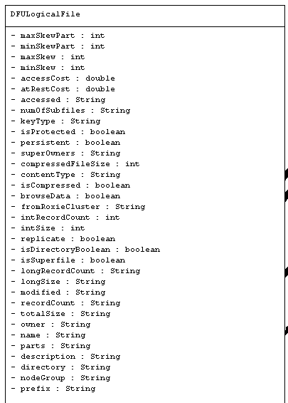

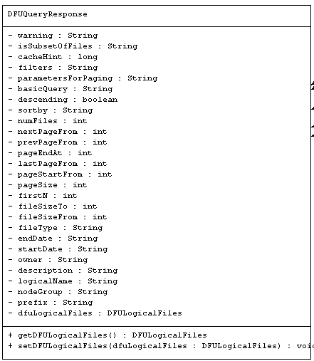

### FilesLogicalFilesTest

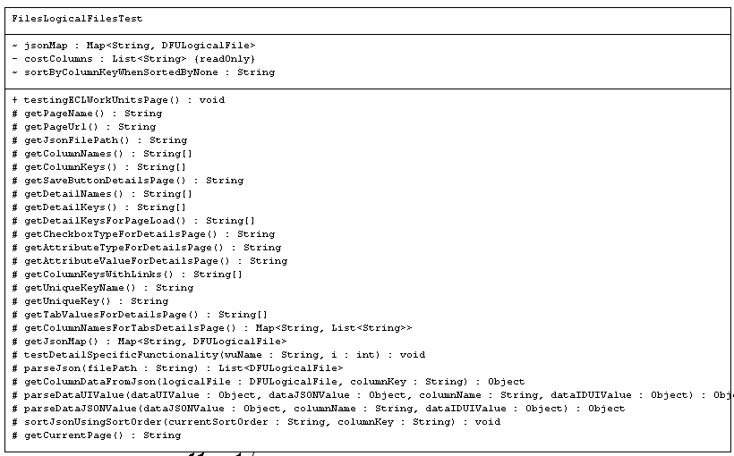

The FilesLogicalFilesTest class is a subclass of BaseTableTest designed to test the 
"Files LogicalFiles" page of a web application. It includes test cases for verifying the 
functionality and data consistency of the LogicalFiles tab and the details page of logical files.
This class uses configuration data and JSON files to automate and validate the ECL Watch UI 
elements and underlying data of Logical Files Tab in the Files navigation menu.

#### Variables:

- `sortByColumnKeyWhenSortedByNone`: Specifies the column key used for sorting columns when no sort order is specified, or the sorting order is "none".
- `costColumns`: A list of column names related to cost.
- `jsonMap`: A map to store logical files keyed by their names for quick lookup.

#### Methods Implementation:

1. **`testingECLWorkUnitsPage`**
    - Purpose: This is a test method annotated with `@Test`, indicating that it is a test case. It triggers the `testPage` method to perform the automated tests on the "Files LogicalFiles" page.
    - Code Flow:
        1. Call the `testPage` method, which handles the test execution for the page.

2. **`getPageName`**
    - Purpose: Returns the name of the page being tested.
    - Code Flow:
        1. Return the string "Files LogicalFiles".

3. **`getPageUrl`**
    - Purpose: Retrieves the URL of the "Files LogicalFiles" page from the configuration.
    - Code Flow:
        1. Try to get the URL from `URLConfig` using the key `URLConfig.NAV_FILES` and `URLConfig.TAB_FILES_LOGICAL_FILES`.
        2. If successful, return the URL.
        3. If an exception occurs, log the exception using `Common.logException` and return an empty string.

4. **`getJsonFilePath`**
    - Purpose: Provides the file path of the JSON file used for testing.
    - Code Flow:
        1. Return the path by concatenating `Config.PATH_FOLDER_JSON` and `Config.FILES_JSON_FILE_NAME`.

5. **`getColumnNames`**
    - Purpose: Returns an array of column header names displayed on the UI.
    - Code Flow:
        1. Return a predefined array of column names such as "Logical Name", "Owner", "Super Owner", etc.

6. **`getColumnKeys`**
    - Purpose: Provides the identifiers used in the HTML code for the respective columns.
    - Code Flow:
        1. Return an array of column keys like "Name", "Owner", "SuperOwners", etc.

7. **`getSaveButtonDetailsPage`**
    - Purpose: Returns the label of the save button on the details page.
    - Code Flow:
        1. Return the string "Save".

8. **`getDetailNames` and `getDetailKeys`**
    - Purpose: These methods return arrays of detail names and keys for the details page.
    - Code Flow:
        1. Return empty arrays as placeholders. Code needs to be added here when writing test cases for details page of logical files.

9. **`getDetailKeysForPageLoad`**
    - Purpose: Provides the keys used to load details on the page.
    - Code Flow:
        1. Return an empty array. Code needs to be added here when writing test cases for details page of logical files.

10. **`getCheckboxTypeForDetailsPage`**
    - Purpose: Specifies the type of checkbox used on the details page.
    - Code Flow:
        1. Return the string "checkbox".

11. **`getAttributeTypeForDetailsPage`**
    - Purpose: Returns the attribute type used on the details page.
    - Code Flow:
        1. Return the string "type".

12. **`getAttributeValueForDetailsPage`**
    - Purpose: Returns the attribute value used on the details page.
    - Code Flow:
        1. Return the string "value".

13. **`getColumnKeysWithLinks`**
    - Purpose: Provides column keys that contain links.
    - Code Flow:
        1. Return an array with the key "Name".

14. **`getUniqueKeyName` and `getUniqueKey`**
    - Purpose: These methods return the unique key name and key used to identify logical files.
    - Code Flow:
        1. `getUniqueKeyName`: Return the string "Logical Name".
        2. `getUniqueKey`: Return the string "Name".

15. **`getTabValuesForDetailsPage`**
    - Purpose: Returns the tab values for the details page.
    - Code Flow:
        1. Return an empty array. Code needs to be added here when writing test cases for details page of logical files.

16. **`getColumnNamesForTabsDetailsPage`**
    - Purpose: Provides column names for tabs on the details page.
    - Code Flow:
        1. Return an empty map using `Map.ofEntries()`. Code needs to be added here when writing test cases for details page of logical files.

17. **`getJsonMap`**
    - Purpose: Returns the `jsonMap` containing logical files.
    - Code Flow:
        1. Return the `jsonMap`.

18. **`testDetailSpecificFunctionality`**
    - Purpose: Placeholder for implementing test-specific functionality for details.
    - Code Flow:
        1. Empty method for potential overrides. Code needs to be added here when writing test cases for details page of logical files.

19. **`parseJson`**
    - Purpose: Parses a JSON file and returns a list of `DFULogicalFile` objects.
    - Code Flow:
        1. Create an `ObjectMapper` instance.
        2. Read the JSON file into a `DFUQueryRoot` object.
        3. Extract the `DFUQueryResponse` from the root.
        4. Retrieve the list of `DFULogicalFile` objects.
        5. Populate the `jsonMap` with logical files keyed by their names.
        6. Return the list of logical files.

20. **`getColumnDataFromJson`**
    - Purpose: Extracts data from a `DFULogicalFile` object based on a given column key.
    - Code Flow:
        1. Use a `switch` statement to match the column key and return the corresponding value from the `DFULogicalFile` object.

21. **`parseDataUIValue`**
    - Purpose: Parses and formats the UI value for comparison. Code needs to be added here for parsing other column values from UI that needs to be processed before comparing them with JSON.
    - Code Flow:
        1. Check if the column name is in `costColumns`.
        2. If it is, convert the value to a double after splitting by space.
        3. If the value is a string, trim any whitespace.
        4. Log exceptions if parsing fails using `Common.logException`.
        5. Return the parsed UI value.

22. **`parseDataJSONValue`**
    - Purpose: Parses the JSON value for comparison. Code needs to be added here for parsing other JSON values that needs to be processed before comparing them with UI values.
    - Code Flow:
        1. Return the JSON value directly.

23. **`sortJsonUsingSortOrder`**
    - Purpose: Sorts the JSON data based on the current sort order and column key.
    - Code Flow:
        1. Use a `switch` statement to determine the sort order.
        2. Call `ascendingSortJson` for ascending order.
        3. Call `descendingSortJson` for descending order.
        4. Call `descendingSortJson` with `sortByColumnKeyWhenSortedByNone` if no sort order is specified.

24. **`getCurrentPage`**
    - Purpose: Returns the name of the current page. Code needs to be added here when writing test cases for details page of logical files.
    - Code Flow:
        1. Return the string "Invalid Page". 

### Class Relationship Structure:

